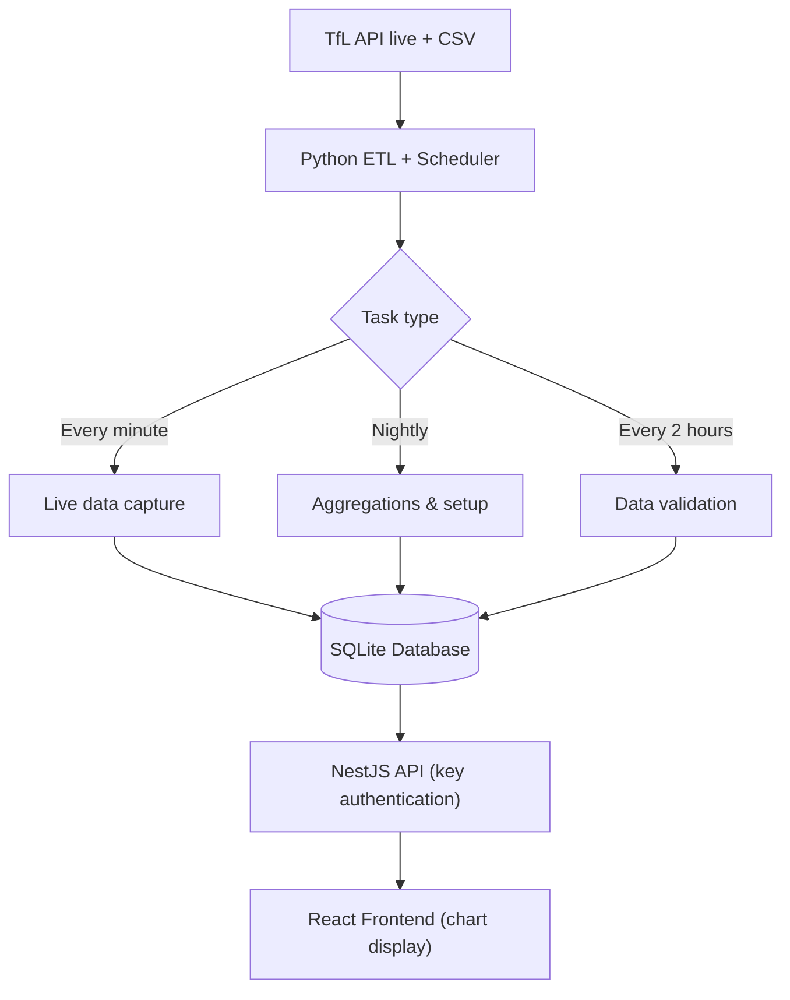
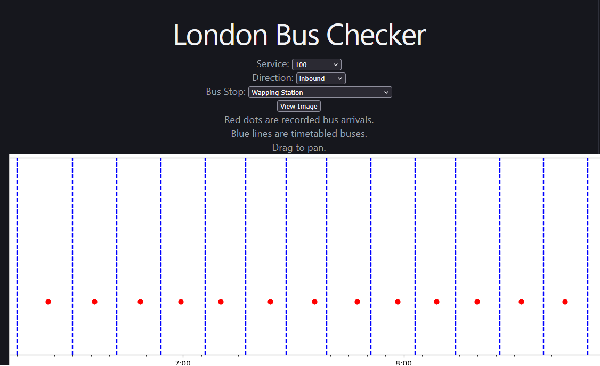

markdown

# 🚌 Reliable Buses – Statistical Bus Arrival Prediction

> **Live demo:** [reliablebuses.com](http://reliablebuses.com)

Predict future bus arrival times using historical and real‑time data from the TfL API. A full‑stack portfolio piece built for real‑world use.

---

## 📖 What this project does

- **Captures** live bus data from the TfL API and stores it in a SQLite database.
- **Runs a custom Python scheduler** (using threads and processes) to orchestrate tasks:
  - **Every minute:** ingests fresh live data from the TfL API.
  - **Every 2 hours:** validates accumulated live data.
  - **Daily (nightly):** runs heavier aggregations, joins, and setup for the day.
- **Verifies** incoming data (e.g. predicted stops vs recorded stops), **joins** stops, routes, timetables, and actual arrivals, and **aggregates** the results.
- **Serves** the processed data via a NestJS API with API key authentication.
- **Displays** a comparison chart (actual vs timetabled arrival times) on a simple React website.

---

## 🧱 Architecture overview

The custom scheduler runs inside the Python ETL component, ensuring that fresh data is always available while heavy computations happen off‑peak.

---

## ✨ Key features (showcasing my skills)

| Area | What I’ve implemented |
|------|------------------------|
| **Data Engineering** | Incremental ingestion from TfL, data cleaning, join logic, and aggregation for statistical analysis. |
| **Concurrency & Scheduling** | Custom Python scheduler using `threading` and `multiprocessing` – one‑minute live updates, every 2 hours validation, nightly batch jobs. |
| **Backend** | NestJS with API key authentication, SQLite integration, and endpoints for services, stops, and image generation. |
| **Frontend** | Minimal React app that fetches and displays a chart image – demonstrating API integration. |
| **DevOps** | Environment‑based configuration (`.env`), linting with Ruff (Python), and a reproducible setup process. |
| **CI/CD** | GitHub Actions automatically runs Ruff linting, builds the NestJS API, and deploys to the live server on every push to master |

---

## 🛠️ Tech stack

| Component | Technologies |
|-----------|--------------|
| **ETL + Scheduler** | Python 3.11, `requests`, `pandas`, `sqlite3`, `threading`, `multiprocessing`, Ruff |
| **API** | NestJS, TypeScript, SQLite, API key authentication |
| **Frontend** | React 18, fetch |
| **Database** | SQLite (shared between ETL and API) |
| **Deployment** | Live server (no Docker – traditional process management) |
| **CI/CD** | GitHub Actions |

---

## 🚀 Installation & setup

### Prerequisites
- Git
- Python 3.12.3+
- Node.js 24+ and npm
- SQLite3 (usually included with Python)

### 1. Clone the repository
Use Git to clone your own fork of the repository, then navigate into the project folder.

### 2. Environment configuration
Each component has an `.env.example` file. Copy it to `.env` and fill in your own values (especially API URL and keys for TfL).

**For the ETL:**  
Go into the `etl` folder, copy `.env.example` to `.env`, then edit the file with your TfL API credentials. To get TFL API credentials, go to [Transport for London](https://api-portal.tfl.gov.uk/)

**For the API:**  
Go into the `api` folder, copy `.env.example` to `.env`, then edit the file. Feel free to use the example database, as it should fill itself out as the program runs, 
otherwise, make sure you have an entry in api_keys with ADMIN privilege.

**For the website:**  
Go into the `website` folder, copy `.env.example` to `.env`, then set the API base URL.

### 3. Set up the NestJS API
Open a terminal in the `api` folder.
First, create a Virtual Environment For the python scripts used by the API:

python3 -m venv venv

source venv/bin/activate # On Windows: .\venv\Scripts\activate
pip install -r requirements.txt

Then run:

- npm install
- npm run build
- npm run start
Or, if using pm2
- pm2 reload ecosystem.config.js

The API will run on `http://localhost:3000` (or the port you set in `.env`).

### 4. Set up the Python ETL + Scheduler
Open a terminal in the `etl` folder, then run:

- python3 -m venv venv
- source venv/bin/activate # On Windows: .\venv\Scripts\activate
- pip install -r requirements.txt

**Start the scheduler** (this will run the minute‑by‑minute live capture, 2 hourly validation, and nightly jobs):

python3 -m etl

### 5. Set up the React frontend
Open a terminal in the `website` folder, then run:

- npm install
- npm run build

Serve the `dist` folder (e.g., with  nginx).

---

## 📡 API endpoints (examples)

All endpoints require an `x-api-key` header (the key you set in `.env`).

| Method | Endpoint | Description | Example |
|--------|----------|-------------|---------|
| GET | `/api/journeys/services` | List all available bus services | `http://reliablebuses/api/journeys/services` |
| GET | `/api/stop/name_from_service` | Get stops for a given service + direction | `?service=123&direction=inbound` |
| GET | `/api/log/arrival_image` | Retrieve chart image comparing actual vs timetabled arrivals | `?service=123&direction=inbound&stop_code=490008660N` |

You can test them with `curl`:

- curl -H "x-api-key: your-api-key" "http://reliablebuses.com//api/journeys/services"
- curl -H "x-api-key: your-api-key" "http://reliablebuses.com/api/stop/name_from_service?service=100&direction=inbound"
- curl -H "x-api-key: your-api-key" "http://reliablebuses.com/api/log/arrival_image?service=100&direction=inbound&stop_code=490002076Y"

for example of demo api calls, replace "your-api-key" with the public demo api key - MIGfMA0GCSqGSIb3DQEBAQUAA4GNADCBiQKBgQClwEBUGdM1IvWT

---

## 🖥️ Frontend usage

Open the frontend URL (e.g., `http://localhost:5173` or your live domain).  
Select a **service**, **direction**, and **stop code** – the page will display an image similar to this:

  

---

## 🔮 Future improvements

- Write comprehensive tests for both the ETL scripts and API
- Expand the website to include long term averages, and transfer predictions
- Create a mobile App version

---

## 📝 License

MIT © [Cameron Stephen](https://github.com/Worthashot)

---

## 📬 Contact

- GitHub: [@Worthashot](https://github.com/Worthashot)  
- LinkedIn: [cameron-stephen-433ba8151](https://linkedin.com/in/cameron-stephen-433ba8151)

---

**Built as a portfolio piece – real‑time bus predictions using open data.**

